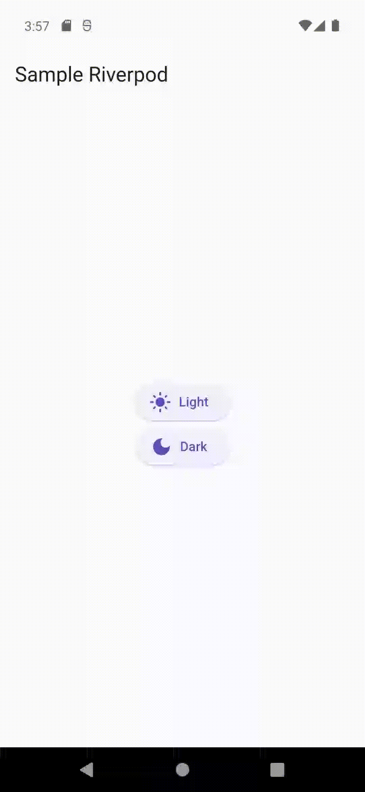

# learn_riverpod

Pequeno estudo sobre o componente Riverpod

## Tutorial

[Flutter Map](https://www.youtube.com/watch?v=7Cp1GlmHTGE&t=15s)
[Exercises](https://youtu.be/qZ21x_ugJjA)

        //! Riverpod set up
        ProviderScope

        //! Easy level
        State Provider

        ConsumerWidget
        ref.watch(riverpod)
        ref.read(riverppod.notifier).state

        //! Hard level (with model)
        ChangeNotifierProvider
        ChangeNotifier
        notifyListeners

        ConsumerWidget
        ref.watch(riverpod).name
        ref.read(riverpod).changeName(newValue)

## Stack

- flutter sdk: '>=3.2.6 <4.0.0'
- flutter_riverpod: ^2.4.10

## Screenshots

## Getting Started

This project is a starting point for a Flutter application.

A few resources to get you started if this is your first Flutter project:

- [Lab: Write your first Flutter app](https://docs.flutter.dev/get-started/codelab)
- [Cookbook: Useful Flutter samples](https://docs.flutter.dev/cookbook)

For help getting started with Flutter development, view the
[online documentation](https://docs.flutter.dev/), which offers tutorials,
samples, guidance on mobile development, and a full API reference.
